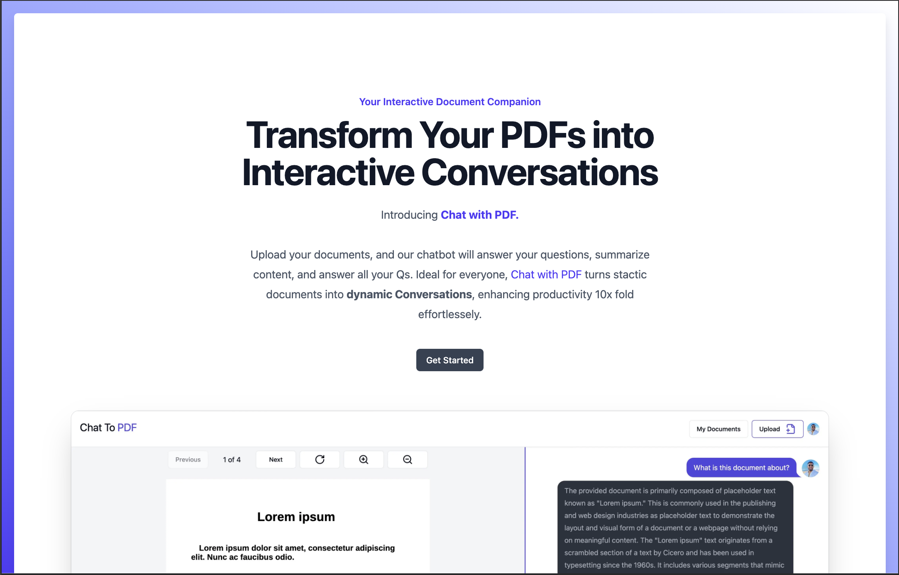
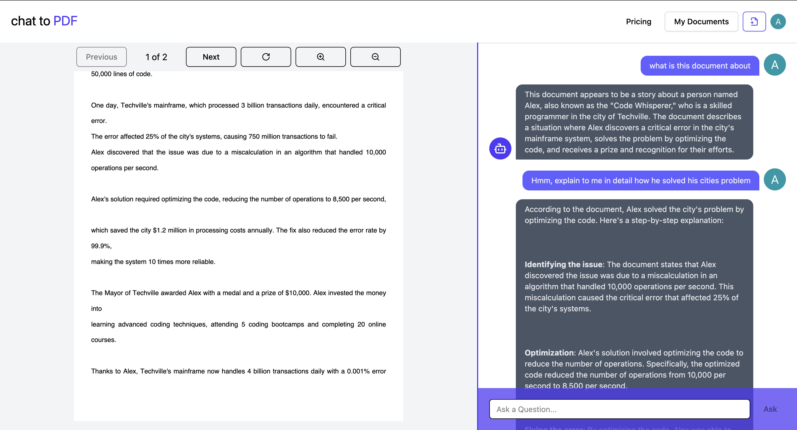

# PDF Chat

An AI-powered PDF chat application built with Next.js that lets you upload PDF documents and have intelligent conversations about their content.

## Features

- Upload and manage PDF documents
- AI-powered Q&A — ask any question about your documents
- Real-time chat with streaming responses
- Secure authentication via Clerk
- Document storage with Firebase
- Vector search powered by Pinecone for accurate answers

## Chat

## How It Works

PDF Chat leverages a full **Retrieval-Augmented Generation (RAG)** pipeline to deliver accurate, context-aware answers from your documents. When a PDF is uploaded, it is parsed and split into chunks, which are then converted into vector embeddings using OpenAI and stored in a Pinecone vector database. At query time, LangChain orchestrates the retrieval — semantically searching the vector store for the most relevant chunks and injecting them as context into the prompt. The LLM (powered by Groq or OpenAI) then reasons over that retrieved context to generate a grounded, document-specific response — rather than relying on general knowledge alone. This agentic retrieval loop ensures answers stay accurate and traceable to the source material.

## Tech Stack

- **Framework:** Next.js 15 (App Router)
- **Auth:** Clerk
- **Database & Storage:** Firebase / Firestore
- **Vector DB:** Pinecone
- **AI / LLM:** LangChain + Groq + OpenAI
- **UI:** Tailwind CSS, Radix UI, shadcn/ui
- **PDF Rendering:** react-pdf

## License

MIT — feel free to use and modify for your own projects.
